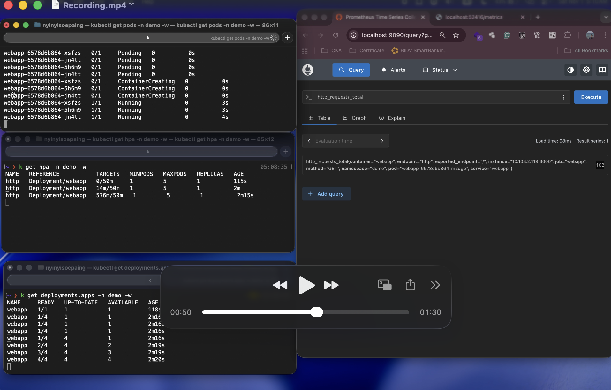

## Recording
<!-- <video width="640" controls>
  <source src="https://raw.githubusercontent.com/NyiNyiSoePaing/k8s_hpa/main/Recording.mp4" type="video/mp4">
  Your browser does not support the video tag.
</video>

 -->


[](https://drive.google.com/uc?export=preview&id=1f00_WZc9WM1bxu_1EhrHMPpQw5gT‑q30)


## 1. Create Namespaces in Kubernetes
- Create `demo` and `monitoring` namespaces
```
kubectl apply -f namespaces
```
## 2. Create Prometheus Operator CRDs
```
kubectl apply -f prometheus-operator-crd
```

## 3. Deploy Prometheus Operator on Kubernetes
```
kubectl apply -f prometheus-operator
```
```
kubectl get pods -n monitoring
```

## 4. Deploy Prometheus on Kubernetes
```
kubectl apply -f prometheus
kubectl get pods -n monitoring
```
```
kubectl logs -l app.kubernetes.io/instance=prometheus -f -n monitoring
```

## 5. Deploy Sample NodeJs App
```
kubectl apply -f demo-app-deploy
``` 
```bash
kubectl get hpa -n demo
# NAME   REFERENCE           TARGETS         MINPODS   MAXPODS   REPLICAS   AGE
# http   Deployment/webapp   <unknown>/50m   1         10        1          111s
```

```
kubectl describe hpa http -n demo
```
```
kubectl get --raw /apis/custom.metrics.k8s.io/v1beta1 | jq
```

## 6. Deploy Prometheus Adapter

```
kubectl apply -f prometheus-adapter/0-adapter 
kubectl apply -f prometheus-adapter/1-custom-metrics  
kubectl apply -f prometheus-adapter/2-resource-metrics     
```
```bash
kubectl get --raw /apis/custom.metrics.k8s.io/v1beta1 | jq
```

### 7. Test HPA with custom metrics

```
ab -n 1000 -c 500 http://localhost:61735/   
```
```
kubectl get hpa -n demo -w
```
```
kubectl get pods -n demo -w
```
```
kubectl describe hpa http -n demo -w

```